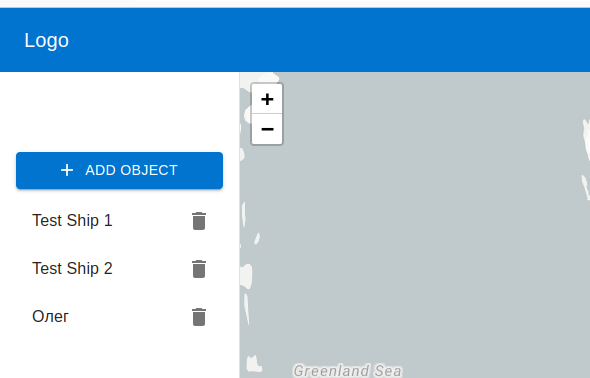
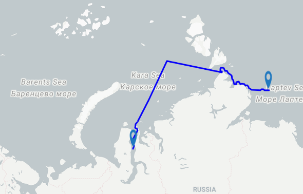
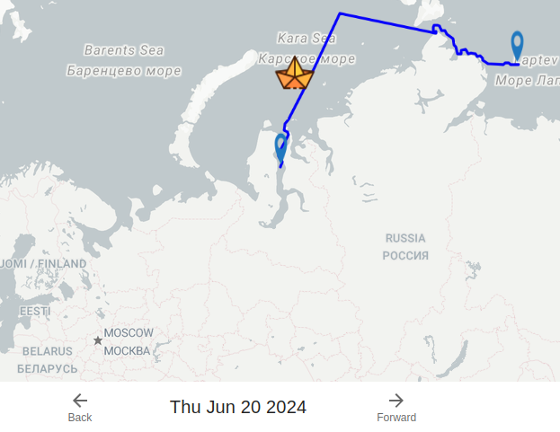
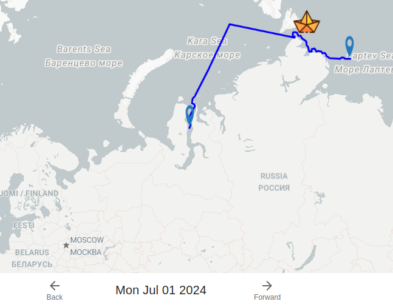

Шаги для запуска бэкенда 

Что бы запустить код надо зайти на ветку main собрать объект карты льдов с помощью файла ```test_map_parser.py``` просмотреть как он выглядит можо с помощью ```map.py```

Далее можно начинать поиск всех путей в файле ```generate_path_for_all_ships.py``` выполняется быстро до 2 минут. 
Далее запустить просчёт караванов ```generate_caravan.py``` 

Теперь можно запускать ```flaskApi.py``` для запуска нашего сервера 

**для теста навигатора используйте класс каробля ```test```**

Запуск React приложения (папка front)


Требования:
- Node.js версии 20.14.0 или выше
- npm (Node Package Manager)

### Шаги для запуска:
- Установка зависимостей:
Перейдите в папку front и выполните команду установки зависимостей:
```bash
cd front
npm install
```
- Запуск приложения:
После установки зависимостей можно запустить React приложение командой:
```bash
npm start
```
- Это запустит локальный сервер для разработки и откроет приложение в вашем браузере по адресу http://localhost:3000.

### Функционал
- Просмотр всех возможных заявок
- Добовление заявки для корабля

- Просмотр разных кораблей/караванов

- Просмотр где в данный момент находится корабль в момент времяни


________

### Запуск Python приложения (папка depart_plan)
### Требования:
- Python версии 3.12.3 или выше
- pip (менеджер пакетов для Python)

### Шаги для запуска:
1) **Установка зависимостей:**
Перейдите в папку depart_plan. Рекомендуется создать виртуальное окружение перед установкой зависимостей (необходимо для изоляции зависимостей от других проектов):
```bash
cd depart_plan
python -m venv venv
```
**Активируйте виртуальное окружение:**

На Windows:
```bash
venv\Scripts\activate
```
На macOS и Linux:

```bash
source venv/bin/activate
```
2) **Установка зависимостей:**
Установите необходимые пакеты Python через pip:

```bash
pip install -r requirements.txt
```
При необходимости убедитесь, что файл requirements.txt содержит все необходимые зависимости.

3) Запуск Python приложения:
После установки зависимостей можно запустить Python приложение для заполнения json для flask сервера. 

```bash
python main.py
```

4) Запуск Flask API (папка flaskApi)

```bash
python app.py
```
Это запустит Flask сервер на http://localhost:5000 (по умолчанию).


Общие рекомендации:
Убедитесь, что у вас установлены все требуемые версии Node.js и Python.
Используйте виртуальные окружения для изоляции зависимостей каждого проекта.
Проверьте файлы package.json (для React приложения), requirements.txt (для Python приложений) на наличие всех необходимых зависимостей.
